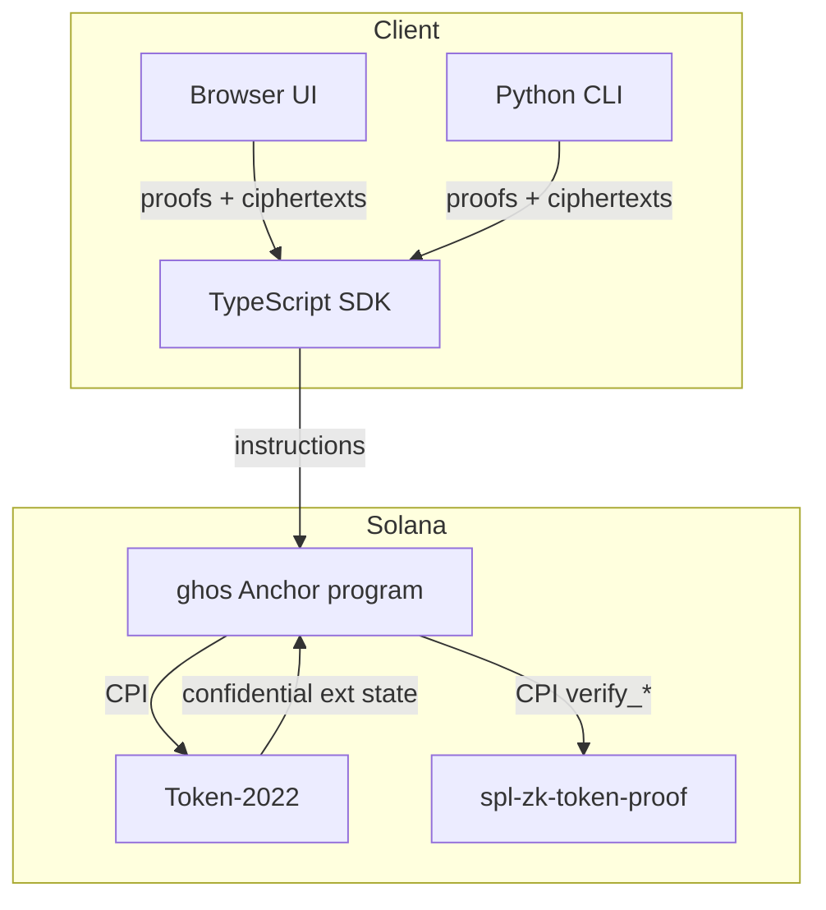
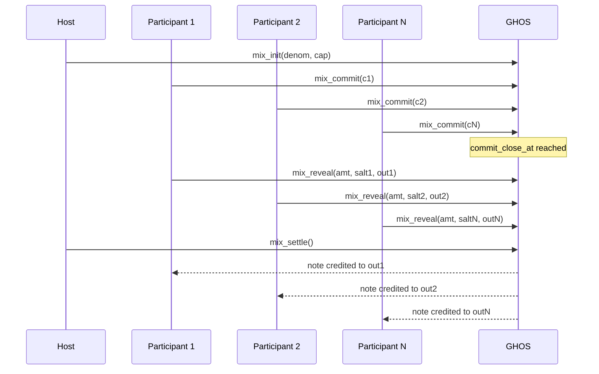

# Architecture

This document is the source of truth for every on-chain account, instruction,
and PDA seed in the ghos program. The codebase in `programs/ghos/src/` is the
authoritative implementation; when the two diverge the Rust source wins and
this document is updated to match.

## System overview



Each client produces twisted ElGamal ciphertexts and bulletproof range
proofs locally. No secret or plaintext amount ever leaves the client. The
ghos program performs two CPIs per confidential transfer: one into the
zk-token-proof program to verify proofs, and one into Token-2022 to mutate
the encrypted balance state.

## Component boundary

| Layer                       | Language   | Location            | Responsibility                                     |
| --------------------------- | ---------- | ------------------- | -------------------------------------------------- |
| On-chain program            | Rust       | `programs/ghos/`    | Account validation, CPI orchestration, events      |
| SDK                         | TypeScript | `sdk/`              | Instruction builders, proof generation, coders     |
| CLI                         | Python     | `cli/`              | Terminal UX, config, offline keypair handling      |
| Docs and tests              | mixed      | `docs/`, `tests/`   | Reference material and integration harness         |

## Program id

| Cluster     | Program id                                         |
| ----------- | -------------------------------------------------- |
| devnet      | `EnKo8EbfJkani8UePTmAVPzdCZM8vMEYYkjTar4fwBPg`     |
| mainnet     | deploy at `EnKo8EbfJkani8UePTmAVPzdCZM8vMEYYkjTar4fwBPg` once audited |
| localnet    | same id, loaded via `anchor.toml`                  |

## Accounts

### GhosConfig (singleton)

Stores protocol knobs settable only by the admin.

| Field                    | Type       | Offset | Notes                             |
| ------------------------ | ---------- | ------ | --------------------------------- |
| discriminator            | u64        | 0      | Anchor discriminator              |
| admin                    | Pubkey     | 8      | Signing authority for config_update |
| version                  | u16        | 40     | Protocol version, currently 0x0401 |
| paused                   | bool       | 42     | Global kill switch                |
| dust_free_unit           | u64        | 43     | 1_000 by default                  |
| burner_ttl_max           | i64        | 51     | Seconds, 30d default              |
| burner_ttl_min           | i64        | 59     | Seconds, 60 default               |
| burner_registry_cap      | u16        | 67     | 64 burner entries per owner       |
| mix_min_participants     | u8         | 69     | 4                                 |
| mix_max_participants     | u8         | 70     | 16                                |
| mix_reveal_window        | i64        | 71     | Seconds, 600 default              |
| auditor_cosign_lamports  | u64        | 79     | Fee withheld for auditor cosign   |
| last_updated             | i64        | 87     | Unix seconds                      |
| bump                     | u8         | 95     | PDA bump                          |
| reserved                 | [u8; 64]   | 96     | Forward compat                    |

Total size: 160 bytes.

### AuditorEntry (per-mint)

```
Pubkey:   ghos.auditor :: mint
```

| Field               | Type       | Offset | Notes                                |
| ------------------- | ---------- | ------ | ------------------------------------ |
| discriminator       | u64        | 0      | Anchor                               |
| mint                | Pubkey     | 8      | Associated Token-2022 mint           |
| auditor_pubkey      | [u8; 32]   | 40     | ElGamal over Ristretto255            |
| registered_at       | i64        | 72     | Unix seconds                         |
| last_rotated_at     | i64        | 80     |                                      |
| rotation_cooldown   | i64        | 88     | Minimum gap between rotations (sec)  |
| admin               | Pubkey     | 96     | Entry admin, inherits GhosConfig.admin |
| bump                | u8         | 128    | PDA bump                             |
| reserved            | [u8; 16]   | 129    |                                      |

Total: 145 bytes.

### BurnerAccount (per-owner, per-nonce)

```
Pubkey:   ghos.burner :: owner :: u64_nonce
```

| Field           | Type      | Offset | Notes                               |
| --------------- | --------- | ------ | ----------------------------------- |
| discriminator   | u64       | 0      | Anchor                              |
| owner           | Pubkey    | 8      | Parent signer                       |
| burner_pubkey   | Pubkey    | 40     | Ephemeral signer registered here    |
| created_at      | i64       | 72     |                                     |
| expires_at      | i64       | 80     | created_at + ttl                    |
| nonce           | u64       | 88     | Monotonic, part of seed             |
| revoked         | bool      | 96     | Set by destroy_burner               |
| usage_count     | u32       | 97     | Incremented on each ghos call       |
| bump            | u8        | 101    |                                     |
| reserved        | [u8; 16]  | 102    |                                     |

Total: 118 bytes.

### MixRound (per-round)

```
Pubkey:   ghos.mix.round :: host :: u64_round_nonce
```

| Field            | Type      | Offset | Notes                           |
| ---------------- | --------- | ------ | ------------------------------- |
| discriminator    | u64       | 0      | Anchor                          |
| mint             | Pubkey    | 8      |                                 |
| denomination     | u64       | 40     | Equal-note amount, atomic       |
| host             | Pubkey    | 48     | Round host                      |
| capacity         | u8        | 80     | [MIN, MAX] = [4, 16]            |
| committed        | u8        | 81     |                                 |
| revealed         | u8        | 82     |                                 |
| phase            | u8        | 83     | See MixPhase                    |
| opened_at        | i64       | 84     |                                 |
| commit_close_at  | i64       | 92     |                                 |
| reveal_close_at  | i64       | 100    |                                 |
| settled_at       | i64       | 108    |                                 |
| bump             | u8        | 116    |                                 |
| reserved         | [u8; 32]  | 117    |                                 |

Total: 149 bytes.

MixPhase enum:

```
0 Open
1 Commit
2 Reveal
3 Settling
4 Settled
5 Aborted
```

### MixCommitment (per-round, per-participant)

```
Pubkey:   ghos.mix.commit :: round :: participant
```

| Field           | Type      | Offset | Notes                            |
| --------------- | --------- | ------ | -------------------------------- |
| discriminator   | u64       | 0      | Anchor                           |
| round           | Pubkey    | 8      |                                  |
| participant     | Pubkey    | 40     |                                  |
| commitment      | [u8; 32]  | 72     | SHA-256 / Blake3 output          |
| revealed        | bool      | 104    |                                  |
| reveal_signal   | [u8; 32]  | 105    | Auxiliary proof bytes            |
| index           | u8        | 137    | Insertion order                  |
| committed_at    | i64       | 138    |                                  |
| revealed_at     | i64       | 146    |                                  |
| bump            | u8        | 154    |                                  |
| reserved        | [u8; 16]  | 155    |                                  |

Total: 171 bytes.

## PDA seed reference

| PDA                | Seeds                                                     |
| ------------------ | --------------------------------------------------------- |
| GhosConfig         | `"ghos.config"`                                          |
| AuditorEntry       | `"ghos.auditor"` + mint                                   |
| BurnerAccount      | `"ghos.burner"` + owner + u64_le(nonce)                   |
| MixRound           | `"ghos.mix.round"` + host + u64_le(round_nonce)           |
| MixCommitment      | `"ghos.mix.commit"` + round + participant                 |
| PaddingVault       | `"ghos.padding"`                                          |

All seeds are ASCII byte strings, no null terminators, matching the Rust
definitions in `programs/ghos/src/constants.rs`.

## Instructions

The program exposes 14 instructions. Every instruction is Anchor-typed and
appears in the generated IDL.

| Ix                           | Args                                                       | Signers             | Mutates                                    |
| ---------------------------- | ---------------------------------------------------------- | ------------------- | ------------------------------------------ |
| `initialize`                 | (none)                                                     | admin               | Creates GhosConfig                         |
| `shield`                     | amount: u64                                                | owner               | Source ATA, confidential account           |
| `confidential_transfer`      | src_ct: [u8;64], dst_ct: [u8;64], range_proof, equality_proof | source_owner     | Both confidential accounts                 |
| `apply_pending_balance`      | (none)                                                     | owner               | Confidential account counters              |
| `withdraw`                   | amount: u64                                                | owner               | Confidential account, destination ATA      |
| `create_burner`              | nonce: u64, burner_pubkey: Pubkey, ttl: i64                | owner               | Creates BurnerAccount                      |
| `destroy_burner`             | (none)                                                     | owner               | Closes BurnerAccount                       |
| `mix_init`                   | round_nonce: u64, denomination: u64, capacity: u8          | host                | Creates MixRound                           |
| `mix_commit`                 | commitment: [u8; 32]                                       | participant         | Creates MixCommitment                      |
| `mix_reveal`                 | amount: u64, salt: [u8;32], output_pk: Pubkey              | participant         | Updates MixCommitment.revealed             |
| `mix_settle`                 | (none)                                                     | host                | Redistributes aggregate note               |
| `auditor_register`           | auditor_pubkey: [u8;32], rotation_cooldown: i64            | admin               | Creates AuditorEntry                       |
| `auditor_rotate`             | new_pubkey: [u8;32]                                        | admin               | Updates AuditorEntry                       |
| `config_update`              | field: u8, value: bytes                                    | admin               | Updates GhosConfig                         |

### shield

```
ghos::shield(amount: u64) -> Result<()>
```

Preconditions: amount > 0, amount % dust_free_unit == 0, mint has the
confidential transfer extension, `source_ata.mint == mint`, signer ==
`source_ata.owner`. Transfers `amount` from the public SPL balance into
the mint's confidential pending balance via the Token-2022
`deposit_confidential` instruction wrapped in a CPI. Emits
`ShieldExecuted`.

### confidential_transfer

```
ghos::confidential_transfer(
  src_ct: [u8; 64],
  dst_ct: [u8; 64],
  range_proof: Bytes,
  equality_proof: Bytes,
) -> Result<()>
```

Verifies the two proofs via a pair of CPIs to the zk-token-proof program,
then submits a Token-2022 `confidential_transfer` CPI. The
`pubkey_validity_proof` for the destination pubkey is passed through a
separate proof-context account when the destination is first seen.

### apply_pending_balance

```
ghos::apply_pending_balance() -> Result<()>
```

Drains the `pending_balance` counter of the caller's confidential account
into `available_balance`, via Token-2022 CPI. Returns `NothingToApply` if
the pending balance is zero.

### withdraw

```
ghos::withdraw(amount: u64) -> Result<()>
```

Decrypts the available balance locally to sanity check `amount <=
available`, produces a proof-of-decryption, then submits
`withdraw_confidential` against Token-2022. If the mint has an auditor,
`auditor_cosign_lamports` is transferred from the user to the padding
vault to cover the cosign roundtrip.

### create_burner

```
ghos::create_burner(nonce: u64, burner_pubkey: Pubkey, ttl: i64) -> Result<()>
```

Checks `BURNER_TTL_MIN <= ttl <= BURNER_TTL_MAX`, allocates the
BurnerAccount PDA. Owner must sign. Emits `BurnerCreated`.

### destroy_burner

```
ghos::destroy_burner() -> Result<()>
```

Closes the BurnerAccount, refunds rent to owner. Emits `BurnerDestroyed`.
The ephemeral keypair itself is not touched; closing only removes the
registry entry so no further ghos instructions recognize it.

### mix_init / mix_commit / mix_reveal / mix_settle

See `docs/coinjoin.md` for the full protocol state machine. Summary:



### auditor_register / auditor_rotate

Both admin-gated, rotation is blocked within `rotation_cooldown`. The
pubkey byte layout is a Ristretto255 compressed point; any 32-byte
sequence is accepted, decompression errors at use time surface as
`InvalidCiphertext`.

### config_update

Admin-only, protected behind the `paused` flag. Updates one of the
`GhosConfig` fields based on the `field: u8` tag. Reserved for operational
tuning post-deployment.

## Error codes

See `programs/ghos/src/errors.rs` for the canonical list of 34 variants.
They are stable across minor versions; the numeric ordinal of existing
variants never changes, and additions go at the end.

## Events

| Event                          | Emitted by                  |
| ------------------------------ | --------------------------- |
| ConfigInitialized              | initialize                  |
| ConfigUpdated                  | config_update               |
| ShieldExecuted                 | shield                      |
| ConfidentialTransferSubmitted  | confidential_transfer       |
| PendingApplied                 | apply_pending_balance       |
| WithdrawExecuted               | withdraw                    |
| BurnerCreated                  | create_burner               |
| BurnerDestroyed                | destroy_burner              |
| AuditorRegistered              | auditor_register            |
| AuditorRotated                 | auditor_rotate              |
| MixRoundOpened                 | mix_init                    |
| MixCommitted                   | mix_commit                  |
| MixRevealed                    | mix_reveal                  |
| MixSettled                     | mix_settle                  |

Event fields never contain plaintext transfer amounts. Only ciphertexts,
participant public keys, timestamps, and commitment hashes appear.

## Compute budget

| Instruction               | Typical CU | Peak CU  | Notes                                |
| ------------------------- | ---------- | -------- | ------------------------------------ |
| initialize                | 18_000     | 24_000   | One-time                             |
| shield                    | 120_000    | 180_000  | Token-2022 CPI + extension decode    |
| confidential_transfer     | 410_000    | 580_000  | Two zk-token-proof CPIs              |
| apply_pending_balance     | 32_000     | 48_000   | Counter arithmetic only              |
| withdraw                  | 150_000    | 220_000  | zk-token-proof + Token-2022 CPI      |
| create_burner             | 22_000     | 30_000   | Account init                         |
| destroy_burner            | 12_000     | 18_000   | Close account                        |
| mix_init                  | 24_000     | 32_000   |                                      |
| mix_commit                | 30_000     | 40_000   | Hash verify                          |
| mix_reveal                | 38_000     | 50_000   | Commitment re-derivation             |
| mix_settle                | 240_000    | 360_000  | Fan-out proofs                       |
| auditor_register          | 20_000     | 28_000   |                                      |
| auditor_rotate            | 18_000     | 26_000   |                                      |
| config_update             | 14_000     | 20_000   |                                      |

`RECOMMENDED_CU_BUDGET = 600_000` from `constants.rs` sits above the peak
for the heaviest path (confidential_transfer) with headroom for the rest
of the transaction.

## Transaction assembly

A confidential transfer transaction typically contains:

1. `ComputeBudgetProgram.setComputeUnitLimit(600_000)`
2. `ComputeBudgetProgram.setComputeUnitPrice(priority_fee_microlamports)`
3. Optional: `create_burner` if the caller opts into a burner path.
4. The ghos instruction (`shield`, `confidential_transfer`, etc.)
5. Optional: `apply_pending_balance` to roll pending into available.

The SDK's `GhosClient` orchestrates these in a single transaction when
possible; if the combined account set is too large Anchor falls back to
two transactions and atomically reconciles via the pending counter.

## Upgradeability

The program is deployed with `--upgradeable` and the upgrade authority is
the ghos multisig. The `version` field in `GhosConfig` must match the
program's compile-time `PROTOCOL_VERSION`, otherwise every instruction
returns `ProtocolVersionMismatch`. Version bumps flow through a two-step
migration:

1. Admin calls `config_update(field=VERSION, value=new_version)`.
2. Admin deploys the new program binary that expects `new_version`.

The inverse (program upgraded before config bumped) soft-bricks the
program until the admin reverts. This is intentional: it forces the
migration order.

## File map

```
programs/ghos/
  src/
    lib.rs                    entrypoint
    state.rs                  on-chain structs (above)
    errors.rs                 GhosError (34 variants)
    events.rs                 emitted events (above)
    constants.rs              seeds, version tag
    instructions/
      initialize.rs
      shield.rs
      confidential_transfer.rs
      apply_pending.rs
      withdraw.rs
      create_burner.rs
      destroy_burner.rs
      mix_init.rs
      mix_commit.rs
      mix_reveal.rs
      mix_settle.rs
      auditor_register.rs
      auditor_rotate.rs
      config_update.rs
    utils/
      token22.rs              Token-2022 CPI wrappers
      zk.rs                   spl-zk-token-proof CPI helpers
      validation.rs           mint/account guards
```

## Cross-references

- `docs/confidential-transfer.md`: Token-2022 extension details
- `docs/zk-stack.md`: ElGamal, bulletproof, sigma protocols
- `docs/threat-model.md`: adversary capabilities
- `docs/coinjoin.md`: CoinJoin state machine
- `docs/burner-accounts.md`: burner lifecycle details
- `docs/integration.md`: CPI into ghos from another program
- `docs/api-reference.md`: SDK and CLI surface
- `docs/deployment.md`: deploying to devnet and mainnet
