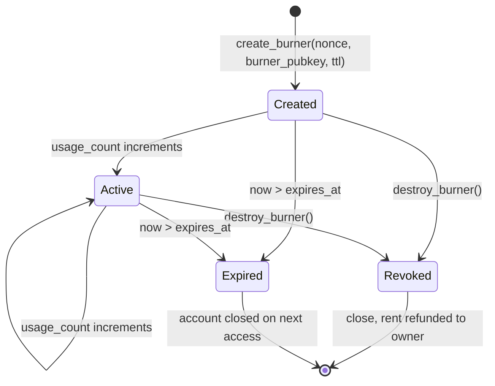

# Burner Accounts

Burner accounts are ephemeral signers registered to an owner for a bounded
lifetime. They exist so the owner can authorize ghos instructions without
exposing the owner's long-lived Solana signer to every transaction.

## Lifecycle



## Use cases

| Scenario                                   | Why a burner helps                                    |
| ------------------------------------------ | ----------------------------------------------------- |
| Frontend ghost session                     | Short-lived signer lives in memory, dies on tab close |
| Automated trading bot                      | Rotate keys without touching the cold wallet          |
| Shared integration environment             | Revoke a single burner without touching others        |
| Privacy-oriented single-use transfer       | Burn after one transfer, limited exposure surface     |
| Mobile app handing off to a desktop        | Temporary cross-device authorization                  |

## Constraints

| Constraint                    | Value                                     |
| ----------------------------- | ----------------------------------------- |
| `BURNER_TTL_MIN`              | 60 seconds                                |
| `BURNER_TTL_MAX`              | 30 days (2_592_000 seconds)               |
| `BURNER_REGISTRY_CAP_PER_OWNER` | 64                                      |
| Signer type                   | Any Ed25519 keypair                       |
| Rent                          | Owner pays rent; refunded on destroy      |

Burner entries always derive from the triple `(owner, nonce)`. The nonce
namespace is per-owner; two owners can use the same nonce without
collision because the PDA seed includes the owner pubkey.

## Seeds

```
PDA = find_program_address(
  [b"ghos.burner", owner, u64_le(nonce)],
  ghos::ID,
)
```

The seed layout guarantees:

- Distinct `nonce` values yield distinct PDAs.
- Distinct `owner` values yield distinct PDAs.
- PDA is deterministic, so the SDK can recompute the entry address
  without reading the ledger.

## Account layout

| Field           | Type    | Notes                              |
| --------------- | ------- | ---------------------------------- |
| discriminator   | u64     | Anchor                             |
| owner           | Pubkey  | Long-lived parent signer           |
| burner_pubkey   | Pubkey  | The ephemeral signer               |
| created_at      | i64     | Unix seconds                       |
| expires_at      | i64     | Unix seconds                       |
| nonce           | u64     | Part of the seed                   |
| revoked         | bool    | Set by destroy_burner              |
| usage_count     | u32     | Incremented on each ghos call      |
| bump            | u8      | PDA bump                           |
| reserved        | [u8;16] | Forward compat                     |

Total: 118 bytes. Rent at 0.05 SOL/byte/epoch works out to a negligible
amount compared to a typical transaction fee.

## Creating a burner

```ts
const result = await client.createBurner({
  ttlSeconds: 24 * 3600, // one day
});
console.log(result.entry.toBase58());
console.log(result.burner.publicKey.toBase58());
console.log(result.burner.secretKey); // keep this secret
```

The SDK defaults to a monotonic nonce derived from `Date.now()`. Supply
a custom `nonce` when you need a deterministic seed (for replay-capable
test harnesses).

## Funding a burner

The burner does not auto-fund. The owner transfers SOL to cover at
least:

- the burner entry rent (paid once at create time),
- a compute-budget prelude per use,
- two signatures per use (owner + burner), or one per use if the burner
  is the sole signer.

```ts
const tx = new Transaction().add(
  SystemProgram.transfer({
    fromPubkey: owner.publicKey,
    toPubkey: burner.publicKey,
    lamports: 50_000_000,
  })
);
await sendAndConfirmTransaction(connection, tx, [owner]);
```

## Using a burner

When a ghos instruction accepts an owner-signed context, the owner is
conceptually the burner for the duration of the session. The on-chain
program validates:

1. `entry.revoked == false`
2. `entry.expires_at > Clock::get()?.unix_timestamp`
3. `entry.burner_pubkey == signer.key`

If any check fails the instruction returns `BurnerExpired` or
`AccountOwnerMismatch`.

## Destroying a burner

`destroy_burner` closes the PDA and refunds rent to the owner.
Destruction is immediate; any in-flight transactions signed by the
burner will fail the active-check and revert.

```ts
await client.destroyBurner({ entry: result.entry });
```

## TTL strategies

| Use case                 | Suggested TTL    |
| ------------------------ | ---------------- |
| Browser session          | 15m to 2h        |
| Mobile app session       | 24h              |
| Cron-driven bot          | 7d               |
| Rare-use backup          | 30d (max)        |

Short TTLs mean less blast radius if the burner secret leaks. Long TTLs
mean fewer rotations.

## Security properties

- The burner key never learns anything about the owner's long-lived
  signer. It is a normal Ed25519 keypair.
- The owner's signer is involved at create and destroy time only. A
  compromise of the burner does not impact other burners or the owner
  itself (beyond the funds already routed through that burner).
- Destroying a burner is cheaper than rotating an owner key, so the
  incentive is to rotate burners often.

## Derivation for reproducibility

Tools that need deterministic burner keys (test harnesses, devnet
seeders) derive:

```
burner_secret = SHA-256(
  b"ghos.burner.v1" ||
  owner_secret[0..32] ||
  u64_le(nonce)
)
burner_keypair = Keypair.fromSeed(burner_secret)
```

This is exactly the algorithm in `examples/burner_wallet_flow.ts`. In
production the burner secret should be cryptographically random; the
determinism path is for test and development only.

## Owner-side bookkeeping

Owners typically keep an index of live burners:

```ts
interface BurnerRecord {
  entry: PublicKey;
  burnerPubkey: PublicKey;
  nonce: number;
  expiresAt: number;
  createdAt: number;
}

const live: BurnerRecord[] = [];

for (let i = 0; i < 64; i++) {
  const [entry] = deriveBurnerPda(owner.publicKey, i);
  const data = await connection.getAccountInfo(entry);
  if (!data) continue;
  // parse and push
}
```

The SDK exposes `client.listBurners(owner)` which does this scan and
returns live entries filtered by TTL + revoked flag.

## Common pitfalls

| Pitfall                                       | Fix                                            |
| --------------------------------------------- | ---------------------------------------------- |
| Creating a burner with TTL < 60s              | Bump to at least 60                            |
| Exceeding 64 live burners per owner           | Destroy unused ones first                      |
| Using an expired burner and getting a silent failure | Treat `BurnerExpired` as a retry with a new burner |
| Leaking the burner secret to logs             | Redact; keep the secret in memory only         |
| Forgetting to fund the burner                 | Transfer SOL before first use                  |

## Interaction with mix rounds

A burner is a natural fit for mix participation: the owner creates a
fresh burner, uses it to commit and reveal, then destroys it. The
output of the mix goes to an output pubkey the burner controls, which
in turn can be a second burner. This chains the anonymity set from one
mix to the next without exposing the owner's long-lived signer.

## Interaction with the auditor

A burner does not carry its own auditor-visible pubkey separately. The
auditor-visible ciphertext is always derived from the mint's auditor
pubkey and the transfer's amount, not from the source signer. A burner
does not leak any more (or less) information to the auditor than a
regular signer.

## Summary

- Use burners for any session-scoped or bot authorization.
- TTL between 1 minute and 30 days.
- Up to 64 per owner.
- Destroyable at any time.
- Derived via PDA `[b"ghos.burner", owner, u64_le(nonce)]`.
