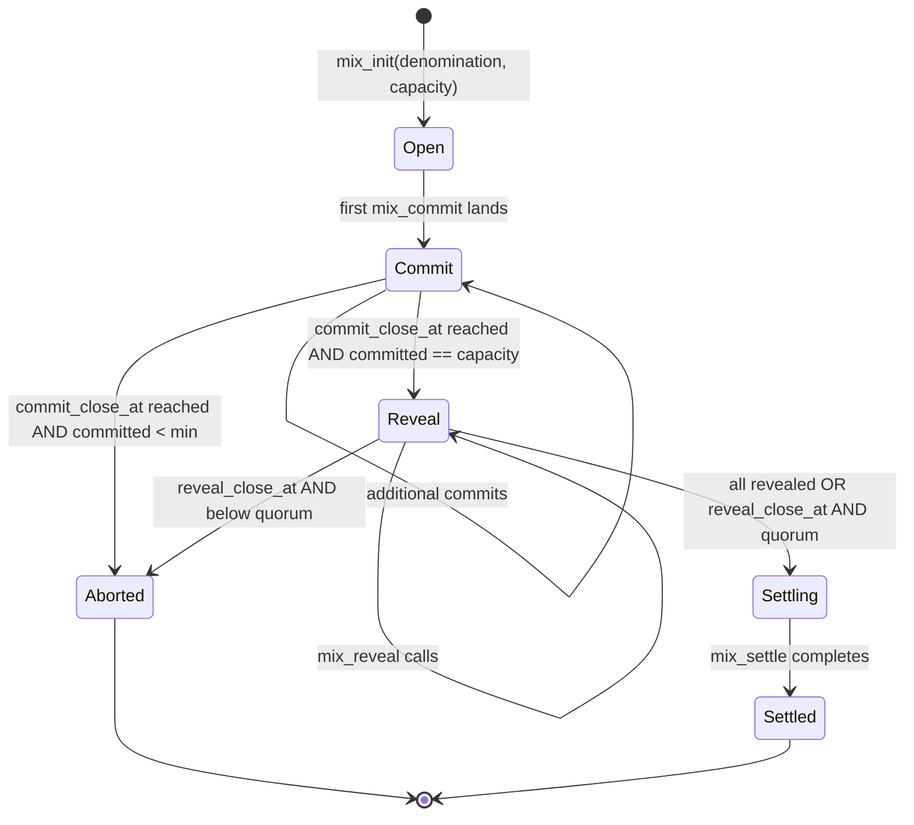

# CoinJoin Rounds

ghos implements a denomination-fixed CoinJoin protocol for confidential
balances. Participants contribute equal notes of the same denomination
to a round; the round settles by redistributing those notes to fresh
output addresses. This is an unlinkability tool, not a value mixer, so
no value is created, destroyed, or hidden.

## Protocol state machine



## Phases

| Phase     | Duration               | What happens                                          |
| --------- | ---------------------- | ----------------------------------------------------- |
| Open      | until first commit     | Participants discover the round via logs              |
| Commit    | up to `commit_close_at` | Participants submit hash(amount, output, salt)         |
| Reveal    | up to `reveal_close_at` | Participants reveal (amount, salt, output)             |
| Settling  | fast, on `mix_settle`  | Host submits aggregate redistribution                 |
| Settled   | terminal               | Accounts closed lazily on next interaction            |
| Aborted   | terminal               | Refund path activated                                 |

Default `commit_close_at = opened_at + 300` seconds (5 minutes).
Default `reveal_close_at = commit_close_at + 600` seconds (10 minutes).

## Capacity and minimum

| Parameter                | Value  | Meaning                             |
| ------------------------ | ------ | ----------------------------------- |
| `MIX_MIN_PARTICIPANTS`   | 4      | Below this the round aborts         |
| `MIX_MAX_PARTICIPANTS`   | 16     | Above this the program rejects      |
| `capacity` (per-round)   | 4..16  | Host-chosen target size             |

## Commitment format

```
commitment = SHA-256(
  "ghos.mix.commit.v1"  ||  // 18 bytes domain tag
  amount_le8            ||  // 8 bytes
  output_pubkey         ||  // 32 bytes
  salt                      // 32 bytes
)
```

The domain tag rules out any chance of a commitment being replayable in
another protocol. The salt prevents grinding: a pre-commit adversary who
knows amount and output still cannot guess the commitment.

## Reveal format

`mix_reveal(amount, salt, output)`:

1. Program loads the MixCommitment entry by PDA
   `[b"ghos.mix.commit", round, participant]`.
2. Recomputes `SHA-256("ghos.mix.commit.v1" || amount_le || output || salt)`.
3. Compares against `entry.commitment`.
4. On match sets `entry.revealed = true` and `entry.revealed_at = clock.now`.
5. On mismatch returns `MixRevealMismatch`.

## Settle

`mix_settle` is called by the host once all participants have revealed
(or the reveal window closes and at least the minimum quorum revealed).
The program:

1. Walks every MixCommitment entry where `revealed == true`.
2. Confirms the recorded amount matches the round's `denomination` for
   every entry; any mismatch aborts.
3. Aggregates the N notes into a single fan-out: each of the N `output`
   pubkeys receives one note of `denomination`.
4. Submits a single Token-2022 confidential transfer with N destinations
   via an aggregated range proof.

## Denomination discipline

Every participant commits the same `denomination` value. A participant
who submits a different amount is caught on reveal. The round never
settles a non-uniform note set. This is what makes the round sound: all
outputs in a settled round are indistinguishable up to the anonymity
set size.

## Anonymity set

The anonymity set of each output equals the number of settled
participants. A round with capacity = 4 delivers an anonymity set of 4.
Chaining two 4-way mixes raises the effective set to 16 (four outputs
per input, each folded into another 4-way mix).

## Failure modes and recovery

| Failure                                          | Outcome                                     |
| ------------------------------------------------ | ------------------------------------------- |
| Commit phase closes with `committed < min`       | Round Aborted, commits refundable           |
| A participant never reveals                      | Their note stays in pending until refund    |
| Reveal phase closes with `revealed < min`        | Round Aborted                               |
| A participant reveals wrong amount / salt        | That participant's note refunded, round    |
|                                                  | continues if remaining quorum >= min        |
| Host never calls `mix_settle` after reveal phase | Anyone can trigger refund after timeout     |

## Refund path

Aborted or expired rounds expose a refund instruction pattern: each
participant whose MixCommitment was revealed sees their equal-note
confidential balance contribution returned via a normal
confidential_transfer back to the original confidential account.

## Host selection

Hosts are bootstrappers. They open a round, cover the rent for the
MixRound PDA, and call settle. Hosts learn nothing about the
participants' outputs beyond the public `output` pubkeys revealed in
the reveal phase (which are fresh, per-round, per-participant addresses
and therefore do not link back to the participant's long-lived signer).

Anyone can be a host. A host with malicious intent cannot break note
discipline because the program validates commitments against reveals.
The worst a host can do is grief by not settling, which triggers the
refund path.

## Concurrency

A single host may run multiple rounds in parallel across different
nonces. Participants can be in multiple rounds at once, one round per
denomination preferred to avoid correlating inputs.

## Fee economics

Each participant pays:

- one signature's worth of lamports per commit
- one signature's worth per reveal
- a share of the compute-budget priority fee

The host pays the MixRound PDA rent and the settle instruction fee.
Everyone benefits; hosts are incentivized by operating public mix
services.

## Client flow

```ts
// participant
const output = ghos.crypto.freshOutputKeypair();
const salt = crypto.getRandomValues(new Uint8Array(32));
const commitment = sha256(
  Buffer.concat([
    Buffer.from("ghos.mix.commit.v1"),
    toU64Le(denomination),
    output.publicKey.toBuffer(),
    Buffer.from(salt),
  ])
);
await client.mixCommit({ round, commitment });

// wait for phase transition to Reveal
await waitForPhase(client, round, "Reveal");

await client.mixReveal({ round, amount: denomination, salt, output: output.publicKey });

// wait for settle
await waitForPhase(client, round, "Settled");
```

## Round discovery

Clients enumerate open rounds via `getProgramAccounts` filtered on
`phase == Open` and `mint == target_mint`. The SDK's
`listOpenMixRounds(mint)` does this and returns sorted by
`opened_at`.

## Time sources

All deadlines are expressed in on-chain clock time via the `Clock`
sysvar. Local clocks may drift; the SDK prints a warning if the local
wall clock diverges from the last-seen block's `blockTime` by more
than 30 seconds.

## Security notes

- Round host cannot unilaterally link inputs to outputs: the mapping is
  one-to-one across the full reveal set, indistinguishable up to the
  anonymity set size.
- A sybil host filling their own round reduces effective anonymity; use
  a mix only when the capacity is filled by diverse participants.
- Never reuse an output pubkey across rounds. The SDK generates a fresh
  one by default.
- Timestamps on MixCommitment reveal the order of operations; they do
  not leak amount info but can hint at which participants are online
  at the same time.

## Worked example

Round settings: `denomination = 100_000 atomic (0.1 units of a 6-decimal
mint), capacity = 4, commit_window = 300s, reveal_window = 600s`.

| Step  | Time  | Action                                        |
| ----- | ----- | --------------------------------------------- |
| 0     | t+0   | Host opens round, `phase = Open`              |
| 1     | t+10  | P1 commits, phase transitions to `Commit`     |
| 2     | t+40  | P2 commits                                    |
| 3     | t+90  | P3 commits                                    |
| 4     | t+150 | P4 commits, round is full                     |
| 5     | t+300 | Commit phase closes, phase becomes `Reveal`   |
| 6     | t+310 | P1 reveals (amount, salt, output1)            |
| 7     | t+320 | P2 reveals                                    |
| 8     | t+330 | P3 reveals                                    |
| 9     | t+340 | P4 reveals                                    |
| 10    | t+341 | Host calls `mix_settle`, phase becomes        |
|       |       | `Settled`, 4 fresh notes credited             |

Each output is a fresh pubkey the participant controls. The anonymity
set from the perspective of an observer watching the settle event is
exactly 4.

## Anti-patterns

- **One-participant rounds**: the minimum is 4. A round with only one
  honest participant and three sybils has anonymity set 1.
- **Known-denomination leak**: opening a round at a denomination that
  matches a prior public transfer fingerprint links the two. Use
  standard denominations (0.1, 1.0, 10.0 of the common decimal).
- **Re-using the output address**: the program does not prevent this,
  but the privacy you bought with the mix is lost as soon as you
  consolidate outputs.

## Further reading

- `docs/zk-stack.md`: commitment hash and range proofs
- `docs/threat-model.md`: sybil and host-collusion risks
- `programs/ghos/src/instructions/mix_*.rs`: on-chain source
