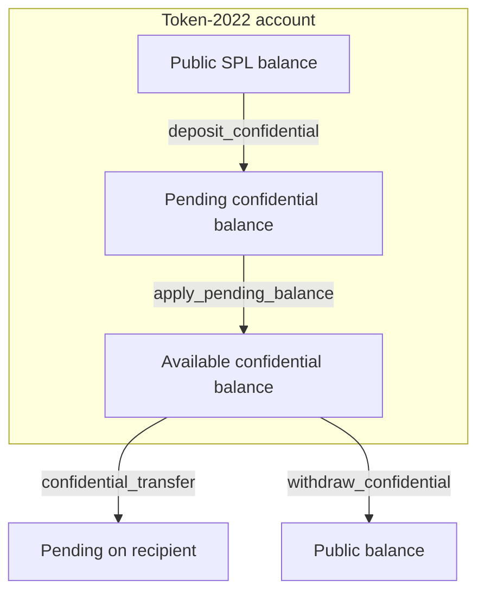
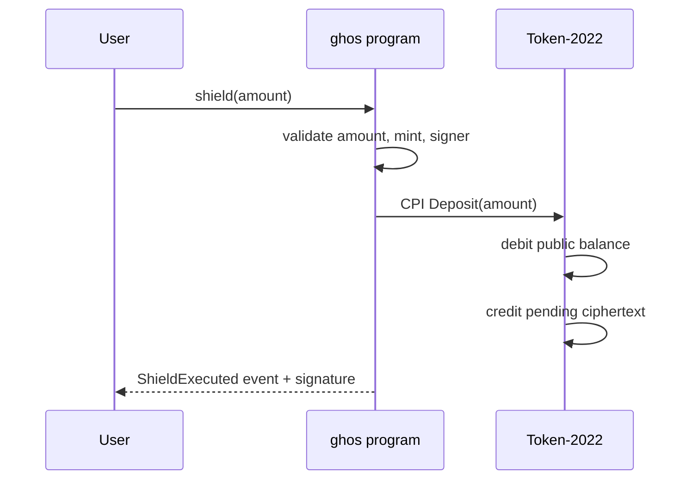
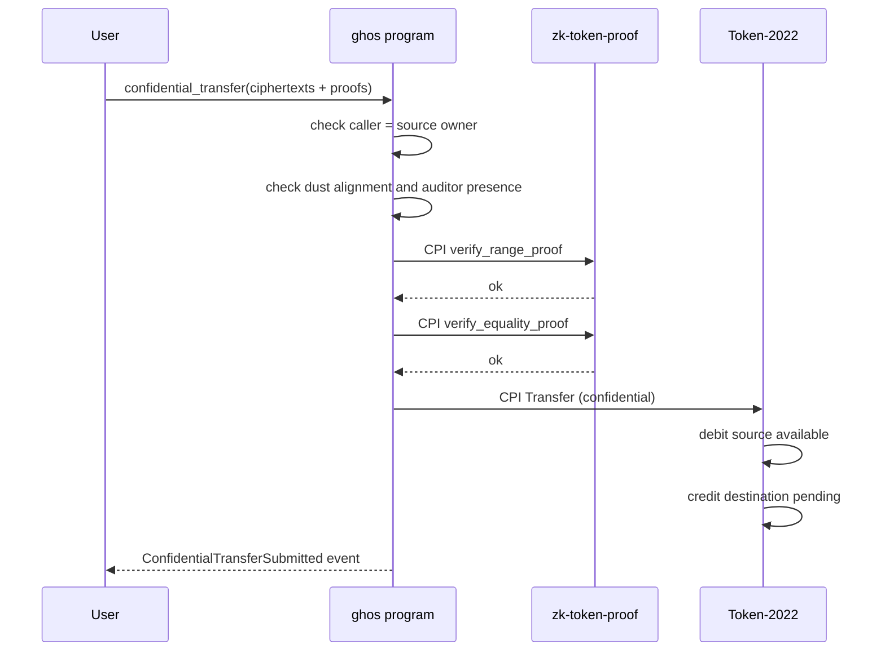
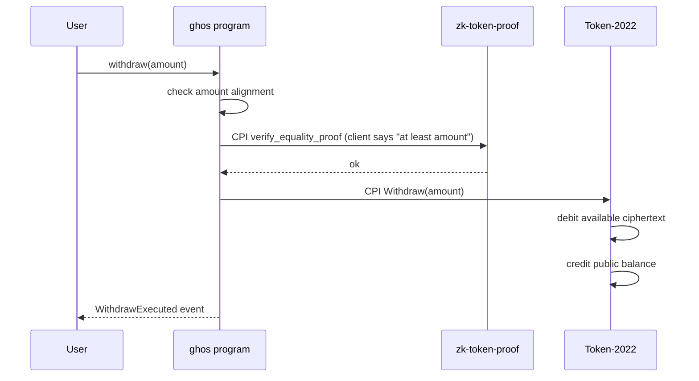

# Token-2022 Confidential Transfer Primer

ghos rides on top of the Token-2022 Confidential Transfer extension. This
document summarizes the extension's behavior so integrators do not have to
read every Solana Labs doc to get started.

## What the extension does

The extension adds two encrypted balance counters to each token account:
a `pending_balance` and an `available_balance`. Both are twisted ElGamal
ciphertexts under the account owner's ElGamal public key.



## Balance counters

| Counter             | Visibility              | How to grow                           | How to drain              |
| ------------------- | ----------------------- | ------------------------------------- | -------------------------- |
| public SPL balance  | plaintext u64           | spl-token transfer, mintTo            | spl-token transfer, burn   |
| pending balance     | encrypted ElGamal ct    | deposit_confidential or receive       | apply_pending_balance      |
| available balance   | encrypted ElGamal ct    | apply_pending_balance                 | confidential_transfer, withdraw |

The split between pending and available exists to keep the available
counter a single ciphertext, so proofs that reference it stay simple. If
ten people all send you money in the same block each new ciphertext lands
in pending; you then pay one `apply_pending_balance` to sum them into
available.

## Extension state

Each confidential account stores:

| Field                        | Notes                                |
| ---------------------------- | ------------------------------------ |
| `encryption_pubkey`          | 32 bytes, ElGamal public key         |
| `decrypt_handle_available`   | auxiliary ciphertext                 |
| `available_balance`          | 64-byte ciphertext                   |
| `pending_balance_low`        | low 48 bits ciphertext               |
| `pending_balance_high`       | high 16 bits ciphertext              |
| `pending_balance_credit_counter` | counts increments, overflow protection |
| `expected_pending_balance_credit_counter` | checkpoint for apply    |
| `approved`                   | set by autoApproveNewAccounts or authority |

The split of pending into two chunks (low 48 / high 16) exists so that
range proofs on apply do not need to cover a full 64-bit width in one
shot.

## Mint-level configuration

A Token-2022 mint with the confidential transfer extension carries:

| Field                           | Notes                                  |
| ------------------------------- | -------------------------------------- |
| `authority`                     | May approve non-auto-approved accounts |
| `auto_approve_new_accounts`     | Skip approval step                     |
| `auditor_elgamal_pubkey`        | Optional, 32-byte pubkey               |

When `auditor_elgamal_pubkey` is set, every confidential transfer must
also encrypt the amount under the auditor's key and supply an equality
proof. ghos enforces this by pinning the mint's auditor pubkey to the
`AuditorEntry` registered in its own program.

## Relevant instructions on Token-2022

| Token-2022 instruction              | Used by ghos via CPI in        |
| ----------------------------------- | ------------------------------ |
| `InitializeConfidentialTransferMint`| `createConfidentialMint` helper only |
| `ConfigureAccount`                  | (SDK before first shield)       |
| `ApproveAccount`                    | (not used when auto-approval)   |
| `EmptyAccount`                      | account close path              |
| `Deposit`                           | `shield`                        |
| `Withdraw`                          | `withdraw`                      |
| `Transfer`                          | `confidential_transfer`         |
| `ApplyPendingBalance`               | `apply_pending_balance`         |
| `EnableConfidentialCredits`         | (admin, when paused->resumed)   |
| `DisableConfidentialCredits`        | (admin emergency)               |

ghos never calls any of these from the user side directly; they are
always CPIs from inside a ghos instruction after the program validates
preconditions (dust alignment, paused flag, auditor presence).

## Shielding sequence



Note that the client does not generate a proof for `shield`; the amount
is public at the source, only the destination counter is encrypted.
The Token-2022 `Deposit` instruction encrypts `amount * H` under the
account's pubkey internally.

## Confidential transfer sequence



## Withdraw sequence

Withdrawing decrypts a known amount out of the confidential balance into
the public SPL balance, revealing only the withdrawn amount.



If the mint has an auditor, a separate equality proof ties the withdrawn
amount to the auditor's keyed ciphertext so the auditor sees the same
number.

## Pending credit counter

Every confidential transfer increments the recipient's pending credit
counter. `apply_pending_balance` requires the counter value the client
expects to apply. This is an anti-DoS feature: an attacker spamming the
recipient with transfers advances the counter, and the next
apply-pending submitted by the legitimate recipient must use the latest
counter value. Token-2022 rejects a stale apply, so the recipient re-reads
the account and submits a fresh apply-pending.

## Auto-approval

When a mint is created with `auto_approve_new_accounts = true`, any
user-configured confidential account is immediately approved for
confidential traffic. This is the expected default for public mints.

Setting auto-approve to false turns the mint into a "gated" mint: the
mint authority must approve each account. This is useful for regulated
mints that want to KYC holders at the Token-2022 layer. ghos does not
take a position on gating; it forwards whatever the mint has configured.

## Decrypt handle

The `decrypt_handle_available` field is a small ciphertext that helps
the owner decrypt their available balance cheaply. It is always updated
alongside `available_balance` and always sums to zero over inbound +
outbound amounts. The SDK reads both fields when displaying a balance.

## Range and width

- Individual ciphertext amounts: 64 bits.
- Aggregate pending: 48 + 16 = 64 bits via low/high split.
- Bulletproof range proofs: 64 bits (672 bytes).

Amounts above `2^64 - 1` cannot be represented and would overflow the
SPL u64 anyway. The SDK enforces this pre-flight.

## Dust-free alignment

ghos adds the dust-free quantization unit on top of Token-2022. Even
though Token-2022 will happily accept amount = 1 lamport, ghos rejects
any amount that is not a multiple of `DUST_FREE_UNIT = 1_000`. This
blocks the class of attacks where an observer correlates a sender to a
recipient via uniquely-sized amounts.

## Lifecycle checklist

When onboarding a new Token-2022 mint:

- [ ] Extension enabled at mint creation (never retroactively)
- [ ] Decimals set deliberately (6 is the common choice)
- [ ] `auto_approve_new_accounts` decision explicit (most public mints: true)
- [ ] If auditor: pubkey set at mint level AND registered in ghos
- [ ] Admin multisig owns `freeze_authority` or is null
- [ ] Mint tested on devnet before mainnet deployment

## Failure cases

| Error from Token-2022                        | User-visible ghos error        |
| -------------------------------------------- | ------------------------------- |
| `InvalidOwner`                               | AccountOwnerMismatch           |
| `InvalidMintDecimals`                        | (not exposed; rejected at SDK) |
| `MaximumDepositAmountExceeded`               | (amount too large)             |
| `AccountNotApproved`                         | AccountNotConfidential         |
| `ElgamalKeyMismatch`                         | InvalidCiphertext              |
| `PendingBalanceCreditCounterExceeded`        | (requires apply_pending_balance) |

## Further reading

- Solana Labs Token-2022 confidential transfer reference: `spl-token-2022`
  crate source
- `docs/zk-stack.md`: the cryptographic details
- `docs/architecture.md`: ghos-side account model
- `docs/threat-model.md`: what this protects, what it does not

## Summary diagram

```
   +--------- public SPL ---------+
   |                              |
   v                              ^
 shield                        withdraw
   |                              |
   v                              ^
 +-- pending --+                  |
 |             |                  |
 v             v                  |
 apply_pending_balance            |
       |                          |
       v                          |
 +-- available ------------------+|
 |                                 |
 v                                 ^
 confidential_transfer (amount X)  |
       |                           |
       +-> +-- pending on recipient -----+
           |                            |
           v                            |
       apply_pending_balance (recipient)|
           |                            |
           v                            |
       +-- available on recipient ------+
                                          ...
```
