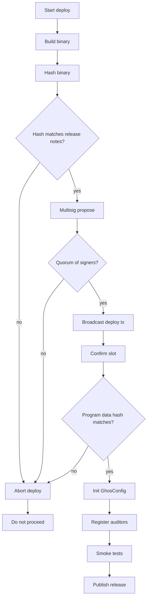

# Deployment

How to build, deploy, and verify ghos on devnet and mainnet.

## Toolchain

| Tool         | Version  | Source                                      |
| ------------ | -------- | ------------------------------------------- |
| Rust         | 1.79.0   | `rust-toolchain.toml`                       |
| Solana CLI   | 1.18.x   | `sh -c "$(curl -sSfL https://release.solana.com/v1.18.22/install)"` |
| Anchor CLI   | 0.30.1   | `avm install 0.30.1 && avm use 0.30.1`      |
| Node         | 20.x     | `.nvmrc`                                    |
| Yarn         | 1.x      | `npm i -g yarn`                             |

## Build matrix

| Target              | Command                                                                 |
| ------------------- | ----------------------------------------------------------------------- |
| Program BPF         | `anchor build`                                                          |
| SDK                 | `yarn workspace @ghos/sdk build`                                        |
| CLI                 | `cd cli && pip install -e .`                                            |
| Docs                | `mkdocs build` (optional)                                               |
| Reproducible build  | `scripts/build.sh` inside the Docker image                              |

## Devnet deployment

```bash
# 1. point CLI at devnet
solana config set --url https://api.devnet.solana.com

# 2. fund the deploy key
solana airdrop 2 $(solana-keygen pubkey ~/.config/solana/id.json)

# 3. build and deploy
anchor build
anchor deploy --provider.cluster devnet

# 4. write the IDL on-chain for client-side use
anchor idl init --filepath target/idl/ghos.json \
  EnKo8EbfJkani8UePTmAVPzdCZM8vMEYYkjTar4fwBPg

# 5. initialize the ghos config PDA
yarn ts-node migrations/deploy.ts

# 6. register any required per-mint auditors
yarn ts-node migrations/seed_auditors.ts

# 7. seed test mints and sample traffic (optional)
yarn devnet:seed
```

## Mainnet deployment

Mainnet deploys are admin-gated behind the ghos multisig. The flow:

1. Build the program binary reproducibly with `scripts/build.sh` inside
   a docker container that pins exact toolchain versions.
2. Compute and publish the binary sha256 hash in the release notes.
3. Propose the deploy transaction to the multisig via Squads.
4. Multisig signers review the binary hash and sign.
5. After quorum the deploy transaction lands on mainnet.
6. Run `migrations/deploy.ts --cluster mainnet-beta` to initialize the
   GhosConfig PDA with the canonical knobs.
7. Run `migrations/seed_auditors.ts --cluster mainnet-beta` if any
   auditor entries are part of the release.
8. Publish the release on GitHub with the binary hash, program id, and
   the genesis-slot of the deploy transaction.

## Verification

After any deploy, anyone can re-run the reproducible build and compare
the binary:

```bash
# build in container
scripts/build.sh

# compute hash
sha256sum target/deploy/ghos.so

# compare against on-chain program
solana program show EnKo8EbfJkani8UePTmAVPzdCZM8vMEYYkjTar4fwBPg
```

The on-chain program's `hash` field (the program executable data hash)
must match the sha256 of the built `ghos.so` artifact.

## Upgrade authority

The upgrade authority is the ghos multisig signer. It is the only key
that can:

- deploy a new version of the program,
- change the upgrade authority,
- freeze the program (make it non-upgradeable).

The upgrade authority is not involved in per-instruction signing; it
has no power over user funds, only over the program binary.

## Rollback

If an upgrade introduces a bug:

1. Build the previous version's binary from the tagged git commit.
2. Verify the hash matches the previous release's hash.
3. Redeploy via the multisig.
4. The `paused` flag can be used between the detection of the bug and
   the landing of the rollback to prevent user transactions from
   hitting the buggy code.

## Freezing the program

To make ghos non-upgradeable (strongly recommended post-audit):

```bash
solana program set-upgrade-authority \
  EnKo8EbfJkani8UePTmAVPzdCZM8vMEYYkjTar4fwBPg \
  --final
```

This is a one-way operation. After it runs no one can upgrade the
program again, including the multisig. Do it only when the codebase is
considered stable.

## Config initialization

The GhosConfig PDA is created by the first `initialize` call. The admin
for the config is the signer of the initialize transaction. On mainnet
this must be the multisig.

```ts
// migrations/deploy.ts snippet
const program = anchor.workspace.Ghos;
const [config] = deriveConfigPda(program.programId);
await program.methods
  .initialize()
  .accounts({
    config,
    admin: multisig,
    systemProgram: SystemProgram.programId,
  })
  .rpc();
```

## Post-deploy smoke tests

After deployment run:

```bash
# config exists
solana account <config-pda>

# a test mint still works
GHOS_CLUSTER=https://api.devnet.solana.com \
GHOS_MINT=<test-mint> \
npx ts-node examples/shield_and_transfer.ts

# event stream is live
GHOS_CLUSTER=https://api.devnet.solana.com \
npx ts-node examples/watcher_bot.ts &
```

A full pass of the integration test suite is the gold standard:

```bash
GHOS_DEVNET_RUN=1 \
GHOS_DEVNET_WALLET=~/.config/solana/id.json \
yarn test:integration
```

## Resource requirements

| Resource                | Approx value              |
| ----------------------- | ------------------------- |
| Program binary size     | 310 KB                    |
| Program rent            | ~2.5 SOL one-time         |
| IDL account rent        | ~0.01 SOL                 |
| GhosConfig rent         | ~0.0015 SOL               |
| AuditorEntry rent       | ~0.0012 SOL per mint      |

## Cluster URLs

| Cluster       | RPC                                       |
| ------------- | ----------------------------------------- |
| devnet        | `https://api.devnet.solana.com`           |
| mainnet-beta  | `https://api.mainnet-beta.solana.com`     |
| localnet      | `http://localhost:8899`                   |

For high-traffic paths use a dedicated RPC provider; the public endpoints
rate-limit aggressively.

## Reproducible builds

`scripts/build.sh` pins:

- base docker image (Ubuntu 22.04)
- Rust toolchain via `rust-toolchain.toml`
- Solana CLI via explicit version
- Anchor CLI via explicit version
- Node via `.nvmrc`

Running `scripts/build.sh` on two different machines yields byte-identical
`target/deploy/ghos.so` outputs. Any divergence indicates a toolchain
drift that must be fixed before deploy.

## Sanity checks during a deploy



## What if something goes wrong

| Symptom                              | First response                                  |
| ------------------------------------ | ----------------------------------------------- |
| Deploy tx fails mid-flight           | Retry with higher priority fee                   |
| Program shows "non-executable"       | Deploy was incomplete; rerun deploy             |
| IDL upload fails                     | Re-run `anchor idl init`; non-blocking for users |
| GhosConfig init fails                | Check admin signer, re-try                      |
| Config version mismatch after upgrade| Set config.version via config_update            |

## Summary

- Build via `scripts/build.sh` for reproducibility.
- Verify binary hash before deploy.
- Use the multisig on mainnet, no exceptions.
- Freeze the program after audit for long-lived deployments.
