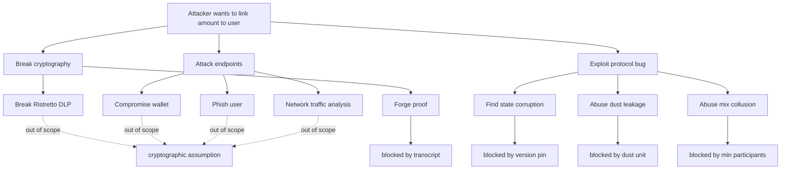

# Threat Model

This is the ghos threat model: adversary capabilities, assets, in-scope
attacks, out-of-scope attacks, and the mitigations each threat maps to.
When a new threat lands it goes here first; if the codebase does not
already defeat it we open a tracking issue and link to this document.

## Assets

| Asset                                | Where it lives                               |
| ------------------------------------ | -------------------------------------------- |
| User ElGamal secret (per-mint)       | Client memory, derived from Solana signer    |
| Solana signer                        | User wallet (hardware, mobile, or browser)   |
| Auditor ElGamal secret               | Auditor-side key vault                       |
| Admin signer                         | ghos multisig                                |
| Confidential balance ciphertext      | Token-2022 confidential account              |
| Mix commitment / reveal              | MixCommitment PDA                            |
| Burner signer                        | Client memory, derived or offline            |
| Transfer amounts                     | Only inside ElGamal ciphertexts              |
| On-chain program binary              | Solana loader, upgradeable by admin          |

## Attacker capabilities

We consider the following capabilities, each independent. Any real
adversary may combine several.

| Capability                                                   | Notes                                      |
| ------------------------------------------------------------ | ------------------------------------------ |
| Read every Solana transaction                                | Public by design                           |
| Submit arbitrary transactions to the cluster                 | Anyone can                                 |
| Observe transaction timing                                   | Networks leak timing at ms granularity     |
| Link IP address to Solana signer                             | Unless Tor / VPN                           |
| Front-run transactions at the validator                      | Known MEV threat                           |
| Rewrite orphaned forks                                       | Solana finality makes this hard, not zero  |
| Compromise a user's wallet                                   | Out of scope for the protocol              |
| Compromise the auditor's key                                 | Considered; see "auditor compromise"       |
| Compromise the admin's multisig                              | Considered; see "admin compromise"         |
| Run a colluding majority in a mix round                      | Considered; see "mix collusion"            |
| Run adversarial SDK / wallet injections                      | Out of scope, user choice                  |
| Break Ristretto255 discrete log in 2^128 work                | Out of scope; cryptographic assumption     |

## In-scope threats

### T1. Plaintext amount leak from the wire

Adversary reads every transaction and tries to recover transfer amounts.

**Mitigation.** Amounts live only inside twisted ElGamal ciphertexts.
Transaction logs and account data expose ciphertexts, commitments, and
participant pubkeys, never plaintext.

### T2. Plaintext leak from events

Adversary scrapes program logs.

**Mitigation.** See `programs/ghos/src/events.rs`: no event field carries
a plaintext amount. `ShieldExecuted.amount_lamports` does carry the
public shield amount by design, since shielding is the one point where
plaintext SOL is consumed.

### T3. Dust-level deanonymization

Adversary crafts a transfer with a unique amount modulo the smallest
tokenization unit. Recipient and sender are then trivially linked.

**Mitigation.** `DUST_FREE_UNIT = 1_000` quantizes every shield /
withdraw / transfer amount. Program returns `AmountNotAligned` otherwise.

### T4. Proof forgery

Adversary constructs a fake range proof that passes verification.

**Mitigation.** Range proofs verified by `spl-zk-token-proof`, which
uses the Ristretto255 bulletproof implementation. Forgery requires
breaking discrete log. We pin canonical point encoding on every
ciphertext to prevent malleability.

### T5. Stale transcript replay

Adversary replays a captured proof on a different ciphertext.

**Mitigation.** Every Merlin transcript absorbs the ciphertexts it
attests to; reusing a proof with different ciphertexts changes the
challenge and falsifies verification.

### T6. Mix collusion

A minority of adversarial participants try to link an honest user's
input to their output.

**Mitigation.** Anonymity set scales with `MIX_MIN_PARTICIPANTS = 4`.
Recommended real-world capacity is 8 or 16 for meaningful privacy. Users
should never join a round with capacity below 4. Commit-reveal uses
domain-separated hashes so an adversary cannot pre-commit to a target
output.

### T7. Mix host withholding

Host opens a round, lets participants commit, then never triggers
`mix_settle`.

**Mitigation.** After `MIX_REVEAL_WINDOW_SECONDS`, anyone can call a
refund path that returns each revealed participant's note to their
original confidential balance. Dead rounds do not lock funds.

### T8. Burner replay

Adversary snapshots a burner entry, waits until after TTL, and tries to
reuse.

**Mitigation.** `burner_is_active(entry, now)` enforces
`!revoked && expires_at > now`. Using an expired burner returns
`BurnerExpired`. Replaying a destroyed burner fails on account-closed
lookup.

### T9. Admin capture

Adversary controls the admin multisig and pushes a config update that
opens a backdoor.

**Mitigation, partial.** The multisig is the root of trust for the
config knobs, not for user funds. Even a captured admin cannot decrypt
confidential balances or withdraw user funds; they can only toggle
paused, adjust TTL bounds, or rotate the auditor key. User-held ElGamal
secrets remain outside the admin's reach.

### T10. Auditor capture

Adversary compromises the auditor secret.

**Impact.** Adversary can decrypt every past and future transfer on the
affected mint. This is the expected cost of having an auditor at all;
ghos does not claim to protect against it.

**Mitigation.** `auditor_rotate` replaces the pubkey on-chain, after
which new transfers encrypt to the new key. Old ciphertexts remain
decryptable with the old key. Admins are expected to rotate on any
suspected compromise. The cooldown prevents a flood of rotations that
could hide a malicious intermediate key.

### T11. Front-running transfer proofs

Adversary observes a pending proof in the mempool and submits a
conflicting instruction with a higher priority fee.

**Mitigation.** The proof binds the exact source / destination
ciphertexts. A front-run cannot retarget the proof to a different
recipient. At worst the attacker burns fees to land a duplicate.

### T12. Confidential transfer destination grief

Adversary spams a target with transfers to inflate their pending
balance and force the target to pay an apply_pending cost.

**Mitigation.** `apply_pending_balance` is O(1) on-chain. The cost is
one signature and about 50k CU. Spam is annoying but not expensive. A
future version may gate pending increments behind a destination-side
accept step.

### T13. Sybil mix participants

Adversary opens a round with `capacity = MIX_MAX_PARTICIPANTS` and fills
every slot themselves, giving the one honest victim an anonymity set of
1.

**Mitigation.** SDK and CLI warn on any round where the caller knows
the host and all other participants are host-adjacent addresses. The
final decision is with the user. Programmatic Sybil resistance is out
of scope; users should prefer well-known public mix hosts with vetted
participant sets.

### T14. Compute-unit exhaustion

Adversary crafts an input that triggers pathological CU consumption in
the verifier, forcing the transaction to fail after partially mutating
state.

**Mitigation.** zk-token-proof verification runs entirely before the
Token-2022 CPI. If verification fails the transaction reverts with no
state mutation. CU budgets in `docs/architecture.md` include headroom
above the observed peak.

### T15. Protocol version mismatch

Adversary forks the program binary and deploys under a colliding id.

**Mitigation.** Solana does not allow program-id collision. The
`PROTOCOL_VERSION` field pinned in GhosConfig further gates every
instruction against the deployed binary's constant. A rogue binary
under the same upgrade authority is the admin-capture case (T9).

## Out-of-scope threats

### O1. Compromised client device

Browser extension, clipboard hijack, hardware keylogger: out of scope.
If the user's signer is compromised, their confidential balance is
compromised. Mitigation is standard self-custody hygiene.

### O2. Post-quantum adversary

Ristretto255 is not quantum-safe. A future post-quantum ghos variant
would require both a new signature scheme and a new confidential
transfer primitive. Not on the current roadmap.

### O3. Metadata leak at the network layer

IP address, timing, and peer-selection are handled by the RPC and the
wallet, not by ghos. Users who want strong network privacy should route
RPC through Tor and use a local validator for blockchain reads.

### O4. Side-channel on the zk-token-proof program

Compute-unit timing and cache side channels on the validator host are
considered out of scope. We assume the validator processes each
instruction in constant time relative to the proofs' public inputs.

### O5. Legal compulsion

A jurisdiction that compels the auditor or admin to act is a governance
problem, not a cryptographic one. ghos does not attempt to mitigate
legal pressure.

## Attack trees

## Defense in depth

| Layer                   | Concrete defense                                       |
| ----------------------- | ------------------------------------------------------ |
| Program id              | Fixed `EnKo8EbfJkani8UePTmAVPzdCZM8vMEYYkjTar4fwBPg`   |
| Discriminators          | Anchor per-account, per-instruction 8-byte tags        |
| Ownership checks        | `require_keys_eq!` on every mutating instruction       |
| CPI allowlist           | Only Token-2022 and zk-token-proof                     |
| Rent                    | Every account rent-exempt at allocation                |
| Compute budget          | SDK sets 600k CU prelude                               |
| Version tag             | `PROTOCOL_VERSION = 0x0401`                            |
| Paused flag             | Admin emergency stop                                   |

## Residual risk

| Residual risk                                              | Owner                 |
| ---------------------------------------------------------- | --------------------- |
| Auditor compromise on audited mints                        | Auditor operator      |
| Admin-side rogue deployment                                | ghos multisig         |
| User-side wallet compromise                                | User                  |
| Low-capacity mix rounds                                    | User + SDK warnings   |
| Priority-fee spam                                          | User                  |

## Reporting

Security issues go to `security@ghos.xyz`, not public GitHub issues.
See `SECURITY.md` at the repo root.
