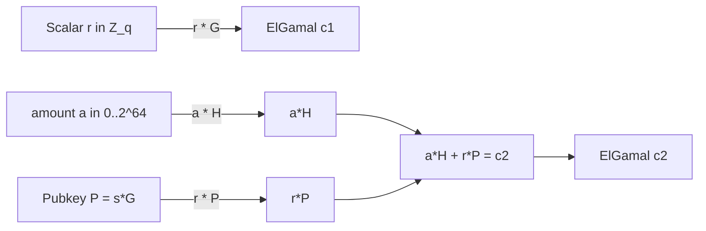
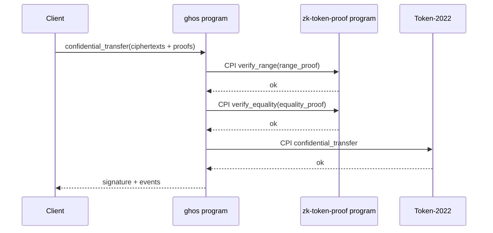
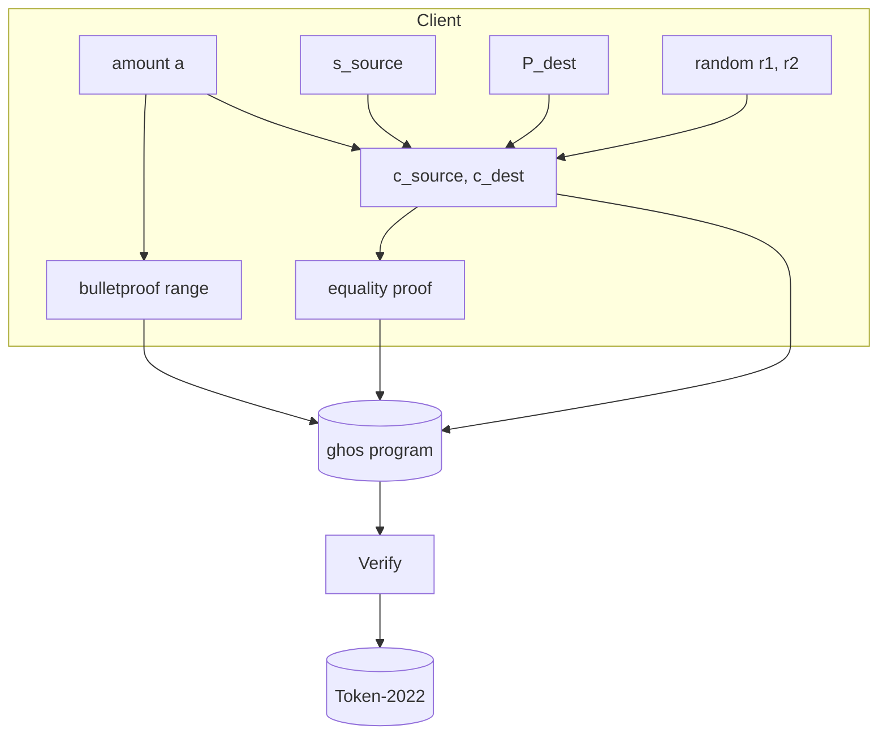

# ZK Stack

This document describes the cryptographic building blocks used by ghos to
keep confidential balances confidential. The protocol composes three
pieces shipped with Solana's Token-2022 confidential transfer extension
plus some light additions for burner accounts and mixing.

## Curves

All ciphertexts live on the Ristretto255 group. Ristretto255 is a prime
order abstraction over the Curve25519 twist; it exposes a clean group API
without the usual edge cases of Edwards curves.

| Property               | Value                                                     |
| ---------------------- | --------------------------------------------------------- |
| Group order            | `2^252 + 27742317777372353535851937790883648493` (prime) |
| Point encoding         | 32 bytes, canonical compression                           |
| Scalar encoding        | 32 bytes, little-endian, canonical reduction              |
| Base point G           | Ristretto255 standard base                                |
| Second generator H     | Hashed-to-curve from a domain-separated tag               |



## Twisted ElGamal

Confidential balances are encrypted under the twisted ElGamal scheme. A
ciphertext is a pair `(c1, c2)` where:

```
c1 = r * G
c2 = a * H + r * P
```

with `P = s * G` the recipient's public key, `s` the corresponding
secret, `r` a uniformly random scalar, `a` the amount, `G` and `H` the
two independent generators.

### Homomorphic addition

Two ciphertexts over the same key can be added component-wise:

```
(c1_A + c1_B, c2_A + c2_B) = Enc(a_A + a_B, r_A + r_B)
```

This is what lets Token-2022 implement a pending / available dual
counter: credits and debits accumulate as encrypted sums without ever
decrypting.

### Decryption

The recipient recovers `a * H = c2 - s * c1`, then solves the discrete
log:

```
a = dlog_H(c2 - s * c1)
```

Because `a` is bounded by the account's 64-bit range, the dlog is solved
by a baby-step / giant-step table keyed by chunks of H. The SDK ships a
precomputed 2^16-entry table; solving a 64-bit amount takes four lookups.

### Key sizes

| Element        | Bytes |
| -------------- | ----- |
| ElGamal secret | 32    |
| ElGamal pubkey | 32    |
| Ciphertext     | 64    |
| Pedersen commit| 32    |

## Bulletproofs

Bulletproofs give us logarithmic-size range proofs without a trusted
setup. ghos uses the 64-bit variant that proves `0 <= a < 2^64`.

### Proof shape

```
 proof bytes = [
   A (32) || S (32) ||
   T1 (32) || T2 (32) ||
   tau_x (32) || mu (32) || t (32) ||
   L_vec (log_2(n) * 32) || R_vec (log_2(n) * 32) ||
   a_hat (32) || b_hat (32)
 ]
```

For `n = 64` bits the serialized proof is 672 bytes (checked by the
`stubRangeProof(64).length` assertion in `tests/fixtures/proofs.ts`). The
128-bit variant used in some mix-settle paths is 736 bytes.

### Aggregation

Multiple range proofs over distinct commitments can be aggregated into a
single proof whose size grows logarithmically. mix_settle exploits this:
fanning out N equal-note outputs only costs one aggregated range proof
for the N receivers.

### Verification flow



## Sigma protocols

The extension stack uses sigma protocols for three roles:

| Proof                  | Attests                                                           |
| ---------------------- | ----------------------------------------------------------------- |
| Equality proof         | source amount == destination amount within a transfer            |
| Pubkey validity proof  | the given ElGamal pubkey is a proper Ristretto point             |
| Zero balance proof     | a given ciphertext encrypts zero (used on account close)         |

### Equality proof

Given `(c1_s, c2_s)` encrypting `a` under sender pubkey `P_s` and
`(c1_d, c2_d)` encrypting `a'` under recipient pubkey `P_d`, the
equality proof shows `a == a'`. The client commits to a blinding factor
`k`, receives a Fiat-Shamir challenge `e`, and responds with
`z = k + e * r_delta` where `r_delta = r_s - r_d`.

Wire format:

```
equality_proof = [
  Y0 (32) || Y1 (32) || Y2 (32) ||
  z_s (32) || z_d (32) || z_x (32)
]
```

Total: 192 bytes. Matched by `stubEqualityProof().length`.

### Pubkey validity

Proves `P = s * G` for some secret `s` without revealing `s`. Classic
Schnorr. Wire format is 64 bytes: `R (32) || z (32)`.

### Zero balance

Proves that a ciphertext encrypts zero, given that the ciphertext is
generated by the account owner. Used when closing a confidential
account: the on-chain flow requires an empty available balance, proven
without revealing intermediate state.

Wire format: 96 bytes.

## Fiat-Shamir transcript

All sigma proofs above are made non-interactive via Merlin transcripts.
Each transcript:

1. Binds the protocol version `b"ghos.zk.v1"`.
2. Binds the proof type (`range`, `equality`, `pubkey_validity`,
   `zero_balance`).
3. Absorbs every public input in canonical byte order.
4. Squeezes challenges with BLAKE2b / Strobe.

Desync between prover and verifier transcripts is the single most common
bug source; the SDK has a golden-vector test that pins transcripts for
every proof type.

## Confidential transfer dataflow



## Per-mint auditor

When a mint registers an auditor pubkey `P_aud`, each confidential
transfer additionally carries a secondary ciphertext:

```
c_aud = (r3 * G, a * H + r3 * P_aud)
```

with a fresh `r3`. An equality proof ties `c_aud` to the transfer
amount. The auditor can decrypt any transfer against their mint by
performing the same dlog routine as a normal recipient. The ghos program
never decrypts; it only verifies the equality proof linking `c_aud` to
the transfer.

## Key derivation

The SDK derives ElGamal keys deterministically from the owner's signer
so users do not need to back up a separate secret:

```
ghos_secret = HKDF-SHA256(
  ikm = Ed25519.sign(owner_signer, b"ghos.elgamal.v1"),
  salt = program_id_bytes,
  info = mint_bytes,
  L = 32
)
```

This means:

- Every mint gets a distinct ElGamal key, preventing cross-mint linkage.
- Losing the Solana signer equals losing every confidential balance, so
  backup strategy is the same as regular self-custody.
- The SDK can regenerate keys on any device where the signer is
  available, no cloud or extra seed phrase required.

## Mix commitment

For mix rounds the commitment scheme is:

```
commitment = SHA-256(
  b"ghos.mix.commit.v1" || amount_le8 || output_pubkey || salt32
)
```

The commitment binds exactly the triple `(amount, output, salt)`. On
reveal, the program re-derives the commitment and checks equality. This
is classic commit-reveal; the hash domain tag rules out cross-protocol
replay.

## Notational glossary

| Symbol      | Meaning                                           |
| ----------- | ------------------------------------------------- |
| G           | Ristretto255 base point                           |
| H           | Second generator, for amount blinding             |
| P = s*G     | Public key, s = secret                            |
| a           | Plaintext amount in `0..2^64`                     |
| r           | Random blinding scalar                            |
| (c1, c2)    | Twisted ElGamal ciphertext                        |
| e           | Fiat-Shamir challenge                             |
| Z, T, S     | Bulletproof inner-product vectors                 |

## Proof sizes at a glance

| Proof                     | Bytes | Contributes to |
| ------------------------- | ----- | -------------- |
| Twisted ElGamal ciphertext| 64    | every transfer |
| Bulletproof range (64)    | 672   | every transfer |
| Equality proof            | 192   | every transfer |
| Pubkey validity           | 64    | first-time recipient |
| Zero balance              | 96    | account close  |
| Aggregated range (N=16)   | 928   | mix_settle     |

## Verification CPIs

The on-chain program invokes `spl-zk-token-proof` through three CPI
entrypoints:

```
zk_token_proof::verify_range_proof_u64(&proof_ctx, range_proof)
zk_token_proof::verify_equality_proof(&proof_ctx, equality_proof)
zk_token_proof::verify_pubkey_validity_proof(&proof_ctx, pubkey_validity)
```

Each CPI consumes around 60k to 120k compute units depending on the
proof size. The ghos program packs the proof bytes into a dedicated
proof-context account so the CPI call itself stays under the 10kB ix
data limit.

## Failure modes

| Error                              | Likely cause                                        |
| ---------------------------------- | --------------------------------------------------- |
| RangeProofVerificationFailed       | Wrong amount, wrong pubkey, stale transcript        |
| EqualityProofVerificationFailed    | Ciphertext mismatch, transcript desync              |
| PubkeyValidityProofFailed          | Non-canonical Ristretto compression                 |
| InvalidCiphertext                  | Malformed or non-canonical 64-byte ciphertext       |

## Audit checklist

| Item                                                          | Status |
| ------------------------------------------------------------- | ------ |
| Ristretto255 canonical encoding enforced on every ciphertext | yes    |
| Merlin transcript domain tags versioned                      | yes    |
| Range proofs bound to 0..2^64 bit width                      | yes    |
| Aggregated proofs only accepted where documented             | yes    |
| Auditor ciphertext equality proof mandatory if auditor set   | yes    |
| zk-token-proof CPI only via utils/zk.rs                      | yes    |

## Links to source

- Twisted ElGamal implementation: `sdk/src/crypto/elgamal.ts`
- Bulletproof client: `sdk/src/crypto/bulletproof.ts`
- Sigma proofs: `sdk/src/crypto/sigma.ts`
- Deterministic key derivation: `sdk/src/crypto/keys.ts`
- On-chain CPI helpers: `programs/ghos/src/utils/zk.rs`
